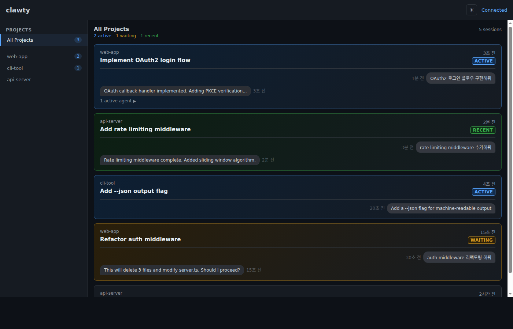
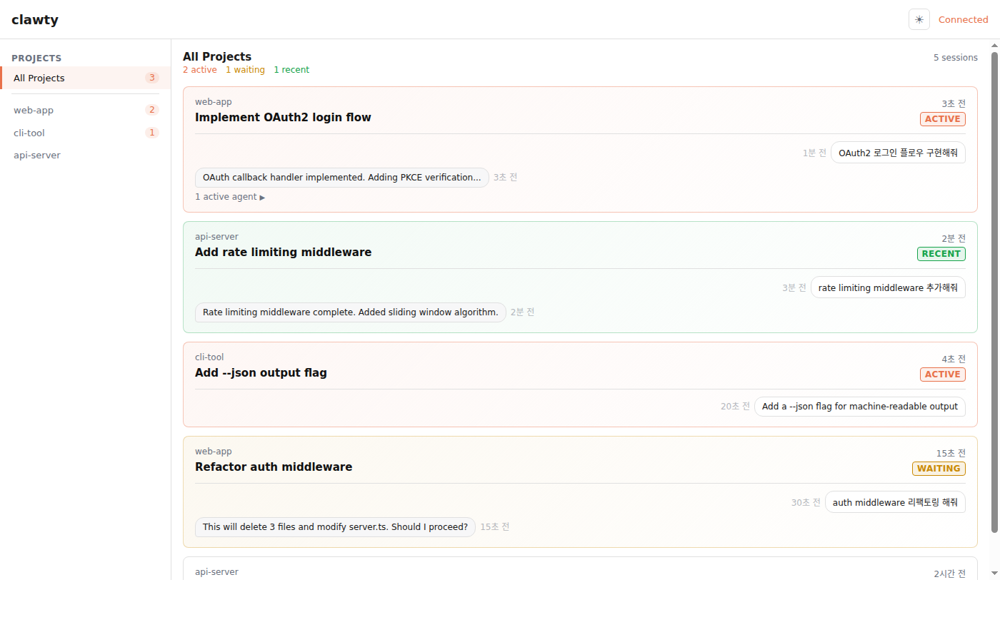

# clawty

### _**Cla**ude, **w**e **t**here **y**et?_

Real-time session monitoring dashboard for [Claude Code](https://docs.anthropic.com/en/docs/claude-code).

Watch your Claude Code sessions come alive — track active sessions, subagent orchestration, and status changes as they happen.

<br>

## Screenshots

| Dark | Light |
|:---:|:---:|
|  |  |

<br>

## Tech Stack


<br>

## Features

- **Real-time monitoring** — SSE-powered live updates, no polling
- **Session status** — ACTIVE / WAITING / RECENT / IDLE at a glance
- **Subagent tracking** — See active agents per session with toggleable details
- **Light & Dark themes** — Auto-detects system preference, manual toggle available
- **Dismiss sessions** — Click RECENT badges to manually mark as IDLE
- **Multi-project view** — Sidebar groups sessions by project
- **Hook integration** — Receives Claude Code lifecycle events (prompt, permission, stop)
- **Zero dependencies** — Pure Bun + TypeScript, no npm packages

<br>

## Installation

```bash
git clone git@github.com:deokdory/clawty.git
cd clawty
./install.sh        # default port 3333
# or
./install.sh 8080   # custom port
```

The install script will:
1. Verify Bun is installed
2. Configure Claude Code hooks in `~/.claude/settings.json`
3. Set up a systemd user service for auto-start
4. Launch the dashboard

Open `http://localhost:3333` (or your chosen port) in a browser.

### Uninstall

```bash
./uninstall.sh
```

Removes the service and hooks. Project files are kept for manual deletion.

<br>

## How It Works

```
Claude Code  ──hook──>  clawty server  ──SSE──>  Browser
   (prompt)                (Bun.serve)               (index.html)
   (permission)            port 3333
   (stop)
```

clawty reads JSONL session logs from `~/.claude/projects/` and receives real-time lifecycle events via HTTP hooks. The browser connects through Server-Sent Events for instant updates.

<br>

## Requirements

- [Bun](https://bun.sh) runtime
- [jq](https://jqlang.github.io/jq/) (for install script)
- [Claude Code](https://docs.anthropic.com/en/docs/claude-code) CLI

<br>

---

<p align="center">
  <sub>Built entirely with Claude Code</sub><br>
  <sub>No human-written code. Seriously.</sub>
</p>
